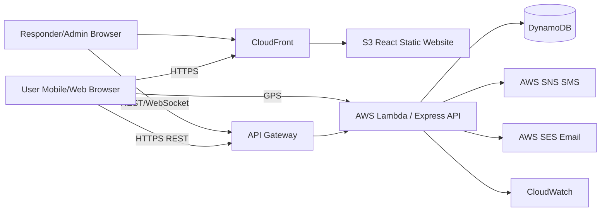

# Architecture

## Cloud service justification

| Need | AWS service | Reason |
|---|---|---|
| Frontend hosting | S3 + CloudFront | Static React hosting and HTTPS CDN |
| API | API Gateway + Lambda | Serverless API and automatic scaling |
| Database | DynamoDB | Managed NoSQL and pay-per-request option |
| SMS | SNS | Native AWS SMS publishing |
| Email | SES | Low-cost transactional email |
| Monitoring | CloudWatch | Logs, metrics and alarms |
| Authentication | JWT in this mini-project | Simple college-level implementation; Cognito can replace it |
| Maps | Leaflet + OpenStreetMap | Free/open mapping library for prototype |
